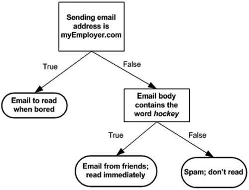

# Decision Trees

The second algorithm dicussed in book "Machine Learning in Action" is decision trees, which is one of the most commonly used classification algorithms.

The idea of decision trees is also quite simple for people to understand intuitively. A picture paints a thousand words:

In short, for each feature of a dataset, we ask question and split datasets by different answers. And for each sub dataset, we recursively ask questions by other features until items in each sub dataset are in the same class.

Training of decision trees can be unstable because small variations in the data might result in a completely different tree being generated. To avoid overfitting, usually, when training, we should reserve enough proportion of the dataset for validating and branches pruning.

And the difference of each decision trees algorithm is mainly on how to decide which feature to choose on each splitting. Usually, the Gini impurity or Shannon entropy of the parent and child datasets are calculated which helps to make the decision.

In the demo if this chapter, a simple ID3 algorithm is implemented. It is simple to understand, but it is important enough for us to understand how the decision trees algorithm works, coz this algorithm is the ancestor of most of the other algorithms such as C4.5, C5.0 and CART. The succeeding algorithms all tries to either remove some restrictions of ID3, or to improve performance at different aspects.

What the ID3 algorithm does on each dataset splitting step is, it tries to calculate the Shannon entropy of both the parent dataset and child datasets for each feature, sorts the results, and chooses the best feature to do the real dataset splitting.

One interesting thing about trees is about tree plotting. In the original demo code of this book, it simply uses the matplotlib for plotting decision trees. It works, but not only the output image not look very nice, but also the code is ugly and hard to read. So in my revised version of potting of trees, I use the pydotplus and graphviz libraries instead to enhance and simplify tree plotting.

## Demo Code

[trees.py](trees.py) - Revised version of the original trees demo

[treesSklearn.py](treesSklearn.py) - A scikit-learn version of trees implementation

[treesPlotter.py](treesPlotter.py) - The scripts for plotting figures in this chapter