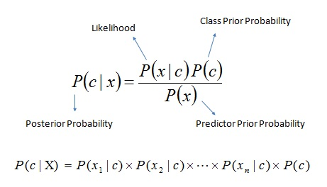

# Naive Bayes

Chapter 4 of book "Machine Learning in Action" introduces the Naive Bayes algorithms.

The basic idea of this algorithm is to do classification based on [Bayes' Theorem](https://en.wikipedia.org/wiki/Bayes%27_theorem) with an assumption of independence among predictors. In simple terms, a Naive Bayes classifier assumes that the presence of a particular feature in a class is unrelated to the presence of any other feature.

For example, a fruit may be considered to be an apple if it is red, round, and about 3 inches in diameter. Even if these features depend on each other or upon the existence of the other features, all of these properties independently contribute to the probability that this fruit is an apple and that is why it is known as 'Naive'.

The Maths basis of Naive Bayes is the statistical class frequency and likelihood, and the Bayes' theorem equation. It enables the calculation of the posterior probability P(c|x), where P(c|x) means the propbability of the predictor x in class c. As long as each feature of a predictor x independently contributes to the probability of x in class c, we could calculate P(c|x) from P(c), P(x) and P(x|c), which can be easily calculated from the training dataset.

- P(c|x) is the posterior probability of class c given predictor x
- P(c) is the prior probability of class c
- P(x|c) is the likelihood which is the probability of predictor x given class c
- P(x) is the prior probability of predictor x

The main pros of Naive Bayes algorithm are it is simple to understand and implement, and super fast to predict class of test dataset, and it doesn't need large training datasets. So it can be used for real time prediction scenarios such as recommendation and spam filtering.

The main potential issue Naive Bayes algorithm has is if the actual class of a test example was not observed in the training dataset, then the model will assign a 0 probability and will be unable to make a prediction. This is often known as "Zero Frequency". To solve this, we have to use some smoothing techniques such as the [Laplace smoothing](https://en.wikipedia.org/wiki/Additive_smoothing).

Another limitation of Naive Bayes is the assumption of independent predictors. In real life, it is almost impossible that we get a set of predictors which are completely independent. And the more dependent the features are, the less accurate the output probability might be.

## Demo Code

[bayes.py](bayes.py) - Revised version of the original bayes demo

[bayesSklearn.py](bayesSklearn.py) - A scikit-learn version of bayes implementation

[bayes_rewritten.py](bayes_rewritten.py) - Runnable all-in-one rewritten version
