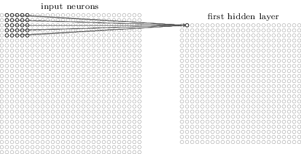
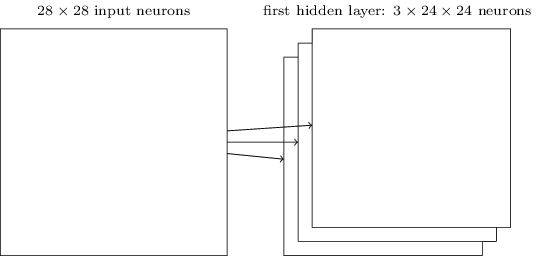
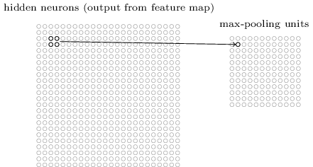

# Deep learning

In [previous chapter](./ch05.md), we mentioned two potential problems of deep neural networks: the vanishing gradient problem and the heavier computation cost problem. These two problems are overcomed in the solution of this chapter by applying ReLu activation function in hidden layders plus the softmax function in the output layer, and by enabling GPU based computation with the help of the theano library. The GPU featureonly works if you have a Nvidia graphics card. But you can still run the demo on a machine without a Nvidia graphics card, it will automatically fallback to use CPU if GPU not available.

But to overcome the two problems above is not the only enhancement. Actually we are doing more and finally we can get up to 99.67% acuracy on 10,000 mnist testing images.

The first additional enhancement here is we are implementing a special type of deep neural network - a convolutional network, which has been proof to work very well for image classification tasks.

Also we use the algorithmic expansion of our training data and the dropout technique to reduce overfitting.

And finally when executing our network, we should use an ensemble of networks, for example to vote for the best acruracy one out of 5 execuions. And ideally, you should get the similar result as shown in the book.

## Introducing convolutional networks

Convolutional neural networks use a special architecture which is particularly well-adapted to classify images.

There are three basic ideas: local receptive fields, shared weights, and pooling.

In a convolutional network, instead of fully connecting the input pixels to a layer of hidden neurons, we only make connections in small, localized regions of the input image. Each point in the first hidden layer linked from for example a 5x5 region. That region in the input image is called the local receptive field for the hidden neuron. And we slide the local receptive field over by one pixel to the right, to the bottom and so on. Note that if we have a 28×28 input image, and 5×5 local receptive fields, then there will be 24×24 neurons in the hidden layer.

Each connection learns a weight. And the hidden neuron learns an overall bias as well. One thing special is we're going to use the same weights and bias for each of the 24×24 hidden neurons. This means that all the neurons in the first hidden layer detect exactly the same feature, just at different locations in the input image. We sometimes call the map from the input layer to the hidden layer a feature map.

To do image recognition we'll need more than one feature map. And so a complete convolutional layer usually consists of several different feature maps:

A big advantage of sharing weights and biases is that it greatly reduces the number of parameters involved in a convolutional network. For each feature map we need 25=5×5 shared weights, plus a single shared bias. So each feature map requires 26 parameters. If we have 20 feature maps that's a total of 20×26=520 parameters defining the convolutional layer, while a 28x28=784 inputs and 30-neoron fully-connected layer would have more than 40 times as many parameters as the convolutional layer.

In addition to the convolutional layers just described, convolutional neural networks also contain pooling layers. Pooling layers are usually used immediately after convolutional layers.

A pooling layer takes each feature map output from the convolutional layer and prepares a condensed feature map. As a concrete example, one common procedure for pooling is known as max-pooling. In max-pooling, a pooling unit simply outputs the maximum activation in the 2×2 input region, as illustrated in the following diagram:

 So if there were three feature maps, the combined convolutional and max-pooling layers would look like:

 

We can think of max-pooling as a way for the network to ask whether a given feature is found anywhere in a region of the image. A big benefit of the pooling layers is that there are many fewer pooled features, and so this helps reduce the number of parameters needed in later layers.

Max-pooling isn't the only technique used for pooling. Another common approach is known as L2 pooling, which takes the square root of the sum of the squares of the activations in the 2×2 region.

Putting it all together, we get the full neural network like below. The final layer of connections in the network is a fully-connected layer plus a softmax function applying to the output layer.

This convolutional architecture is quite different to the architectures used in earlier chapters. But the overall picture is similar: a network made of many simple units, whose behaviors are determined by their weights and biases. And the similar backpropagation could still work.

In the final demo code, we actually have a the second conv and pooling layers right after the first one for better acuracy. But the idea is the same, it is just another layer feature abstraction.

## Other deep neural networks

Demos in this book focus on classifying the MNIST digits. So convolutional networks (CNNs) work the best. But there are other common deep neural network approaches which work better in other scenarios:

- [RNN](https://en.wikipedia.org/wiki/Recurrent_neural_network) - neural networks with time-varying behaviour, suitable for e.g. speech recognition
- [LSTM](https://en.wikipedia.org/wiki/Long_short-term_memory) - enhanced version of RNN which learns faster
- Generative models: [deep belief network (DBN)](https://en.wikipedia.org/wiki/Deep_belief_network), [Boltzmann machine](https://en.wikipedia.org/wiki/Boltzmann_machine), [generative adversarial network (GAN)](https://en.wikipedia.org/wiki/Generative_adversarial_network)

A generative model like a DBN can specify the values of some of the feature neurons and then "run the network backward" to generate values for the input activations. More concretely, a DBN trained on images of handwritten digits can (potentially, and with some care) also be used to generate images that look like handwritten digits. In other words, the DBN would in some sense be learning to write. A second reason DBNs are interesting is that they can do unsupervised and semi-supervised learning.

## Demo Code

[network3.py](network3.py) - The ultimate deep convolutional network implementation.